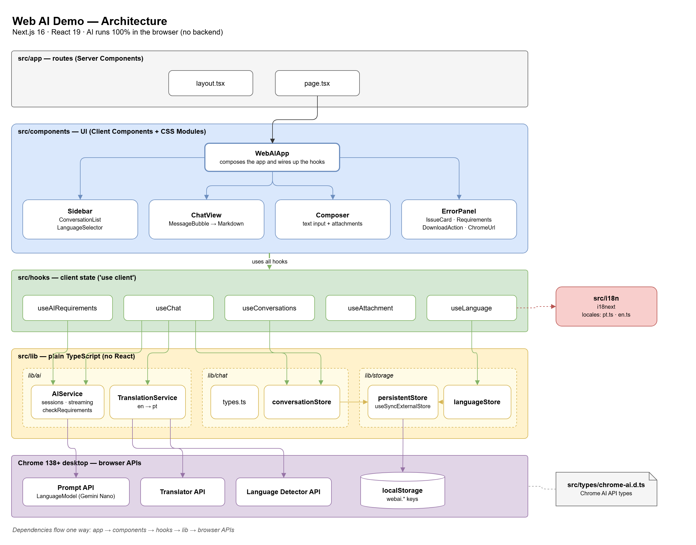

# Web AI Demo

AI chat that runs locally in the browser, using Chrome's built-in AI APIs
(Prompt API with Gemini Nano, Translator API and Language Detector API).

- Conversations with context: each new question takes everything said so far into account.
- Conversations saved in the browser (localStorage), which you can resume, create and delete.
- Image or audio attachments (in English) via the paperclip button or by dragging onto the text box.
- Answers rendered as Markdown.
- Interface in Portuguese or English (i18next). In Portuguese, the model's answers are
  translated with the Translator API; in English, that API is not required.

Stack: **Next.js (App Router) + React + TypeScript**, with CSS Modules.

## Getting started

```bash
npm install
npm run dev      # http://localhost:3000
npm run build    # production build
npm run lint
npm run test:e2e # end-to-end tests (Playwright)
```

Requires Google Chrome 138+ for desktop. If anything is missing (flags, models not
downloaded, hardware), the page itself shows the reason, the steps to fix it and the
minimum requirements.

## Structure

```
src/
├── app/                      # App Router routes
│   ├── layout.tsx            # Root layout: font, metadata and global styles
│   ├── page.tsx              # Home page (Server Component) rendering <WebAIApp />
│   └── globals.css           # Color tokens, reset and base styles
├── components/               # UI components, each with its own CSS Module
│   ├── WebAIApp/             # Composes the app and wires up the hooks
│   ├── Sidebar/              # Brand, new chat, conversation list, language
│   ├── ConversationList/     # Saved conversations (open and delete)
│   ├── LanguageSelector/     # Português or English
│   ├── ChatView/             # Messages (user on the right, assistant on the left)
│   ├── Markdown/             # Markdown rendering for answers
│   ├── Composer/             # Text box, attachment and drag-and-drop
│   └── ErrorPanel/           # Issues found, steps, model download and requirements
├── hooks/
│   ├── useAIRequirements.ts  # Requirement checks and model download
│   ├── useChat.ts            # Sending, streaming, stopping and translating answers
│   ├── useConversations.ts   # Saved conversations
│   ├── useLanguage.ts        # Saved or browser language (default: English)
│   └── useAttachment.ts      # Attached file and its preview URL
├── i18n/                     # i18next: setup, types and strings (pt.ts, en.ts)
├── lib/
│   ├── ai/                   # Chrome AI API integration (no React)
│   ├── chat/                 # Conversation types and operations
│   └── storage/              # localStorage-backed store (conversations and language)
└── types/chrome-ai.d.ts      # Type declarations for Chrome's AI APIs

docs/
├── architecture.drawio       # Architecture diagram (editable in draw.io)
└── architecture.png          # Exported image of the diagram

tests/                        # Playwright end-to-end tests
├── chat.spec.ts              # New chat, question and answer, delete
└── support/chromeAiMock.ts   # Fake Prompt API, so tests run without Gemini Nano
```



### Conversation context

The model keeps the context within its session. There is one active session at a time
(the open conversation's). When switching conversations or reloading the page, the
session is rebuilt from the saved history. Attachments are not saved: after a reload,
the model only sees the text of previous messages.

### Tests

End-to-end tests use Playwright's Chromium, which can't run Gemini Nano. Each test
replaces the Prompt API with the fake in `tests/support/chromeAiMock.ts` (answers are
fixed and streamed word by word), so the tests don't need Chrome, downloaded models or
specific hardware. `npm run test:e2e` starts the dev server by itself (or reuses one
already running on port 3000). Install the browser once with
`npx playwright install --with-deps chromium`.

### Interface strings

`src/i18n/locales/pt.ts` defines the keys; TypeScript requires `en.ts` to have exactly
the same ones. Tags such as `<strong>`, `<kbd>` and `<url>` inside the strings are turned
into components with `<Trans>`.

> Models can only be downloaded after a user click, so the **Download models** button
> calls `create()` synchronously inside its `onClick`.
